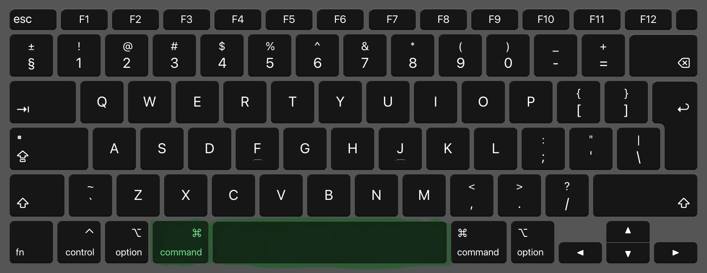
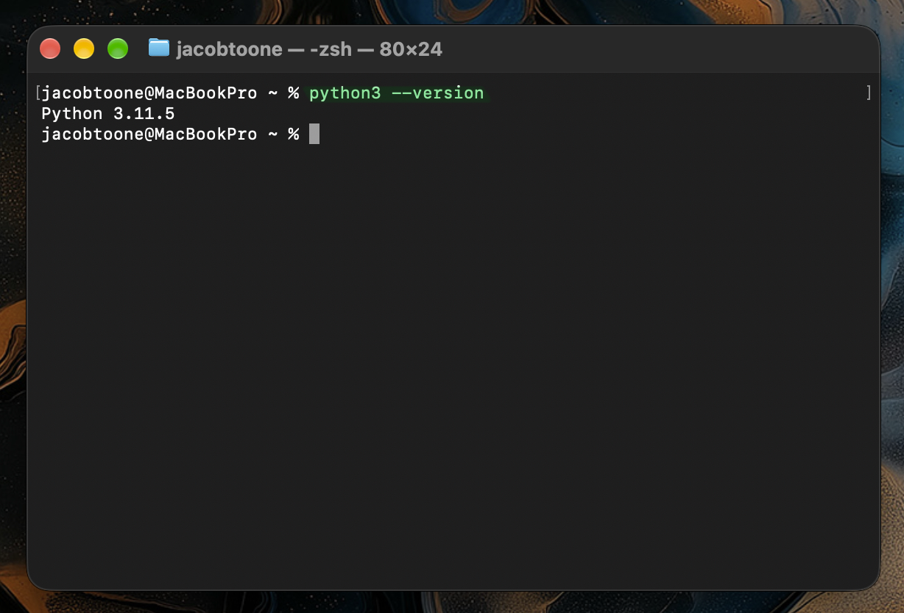
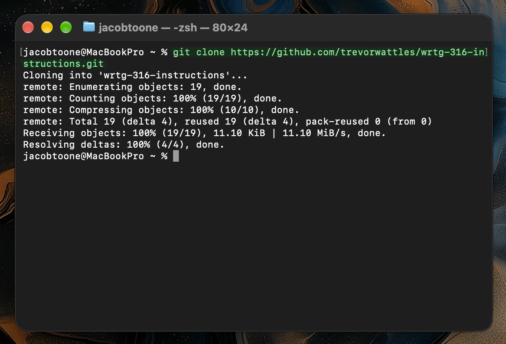
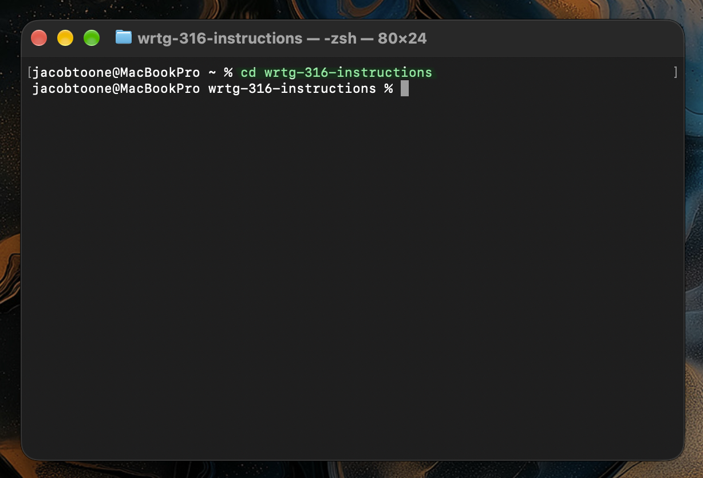

## Numbered Steps

### Step 1: Open the Terminal

1. Press **Command + Space** to open Spotlight Search.

2. Type `Terminal` and press **Return**.
   

A window opens with a line of text that ends in `%`. This window is the terminal.

### Step 2: Confirm That Git and Python Are Installed

1. Type the following command and press **Return**:
   ```
   git --version
   ```
   
2. Type the following command and press **Return**:
   ```
   python3 --version
   ```
   

Each command should display a version number, such as `git version 2.39.5` or `Python 3.9.6`.

### Step 3: Move to Your Home Folder

Type the following command and press **Return**:

```
cd ~
```


### Step 4: Download (Clone) the Program

Type the following command and press **Return**:

```
git clone https://github.com/trevorwattles/wrtg-316-instructions.git
```


Wait until the line `Receiving objects: 100%` appears and the cursor returns.

### Step 5: Open the Program's Folder

Type the following command and press **Return**:

```
cd wrtg-316-instructions
```


### Step 6: Confirm That the Game File Is Present

Type the following command and press **Return**:

```
ls
```
The file `dino.py` should appear in the list.


### Step 7: Enlarge the Terminal Window

Double-click the title bar at the top of the Terminal window to enlarge it. The game needs space to display correctly.


### Step 8: Run the Game

Type the following command and press **Return**:

```
python3 dino.py
```


The dinosaur game appears in the Terminal window.


### Step 9: Play the Game

Use the following keys to play:

| Key                               | Action |
| --------------------------------- | ------ |
| **Space**, **W**, or **Up Arrow** | Jump   |
| **S** or **Down Arrow**           | Duck   |
| **P**                             | Pause  |


### Step 10: Quit the Game

Press **Q** to quit. The normal Terminal window returns.

---

## Troubleshooting

| Problem                                                 | Solution                                                                                                                                                                |
| ------------------------------------------------------- | ----------------------------------------------------------------------------------------------------------------------------------------------------------------------- |
| `command not found` appears in Step 2                   | Git or Python is not installed. Type `xcode-select --install`, press **Return**, and click **Install** in the pop-up window. The installation can take 5 to 20 minutes. |
| `destination path ... already exists` appears in Step 4 | The program is already downloaded. Continue to Step 5.                                                                                                                  |
| `No such file or directory` appears in Step 8           | You are in the wrong folder. Repeat Step 5.                                                                                                                             |
| The game looks cut off or garbled                       | Enlarge the window (Step 7) and run the game again.                                                                                                                     |
| The keys do nothing                                     | Click inside the Terminal window, then try again.                                                                                                                       |
| The Terminal stops responding                           | Press **Control + C** to stop the current command.                                                                                                                      |
