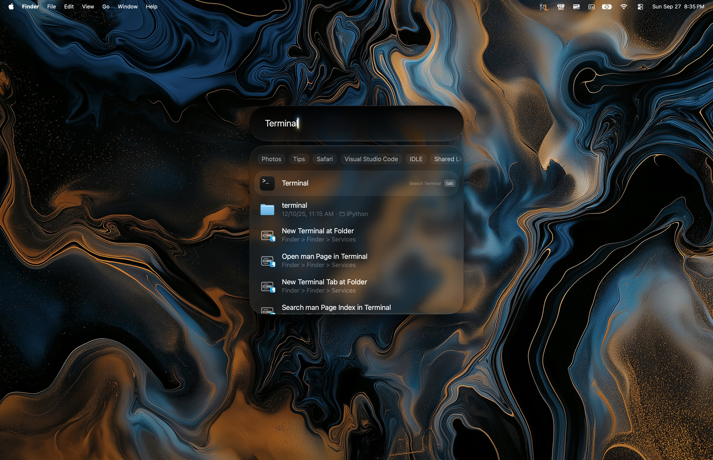
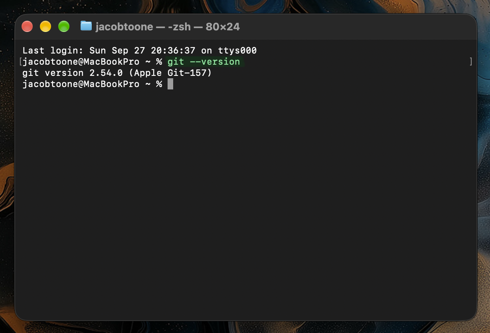
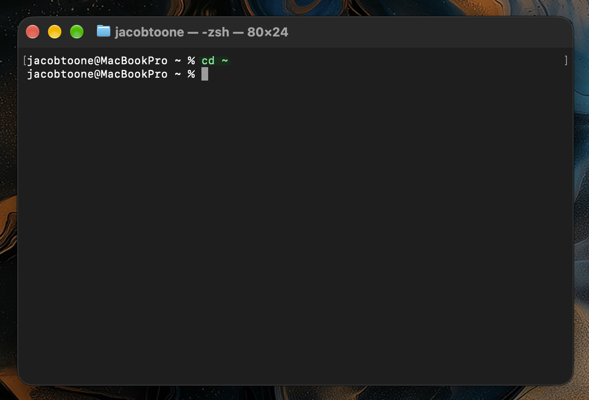
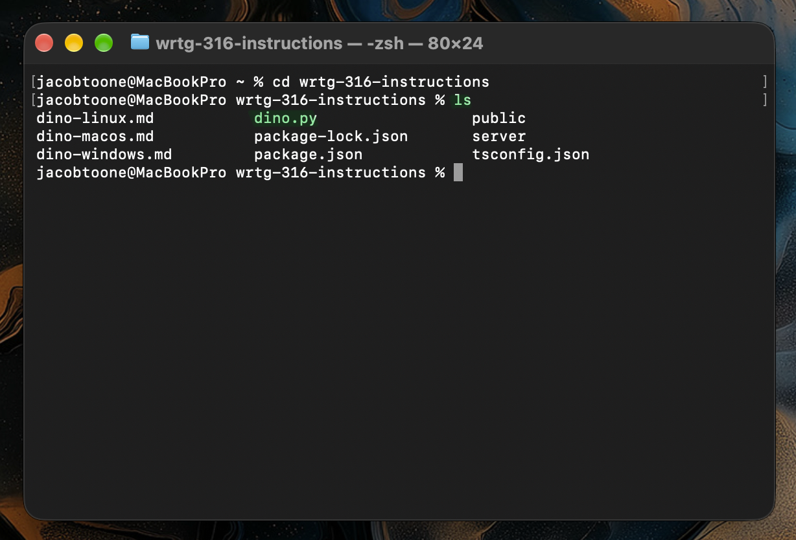
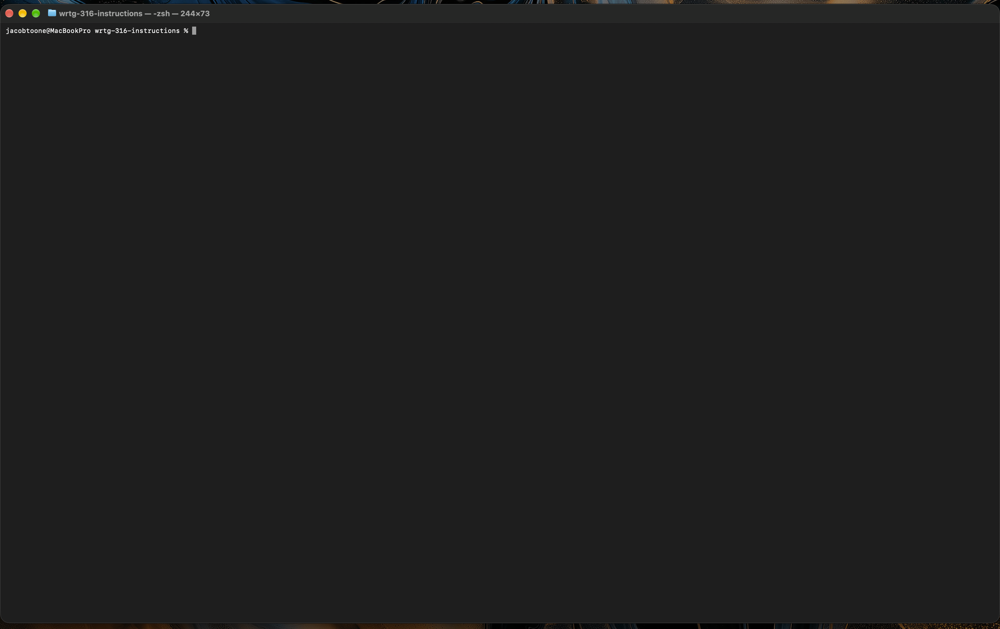
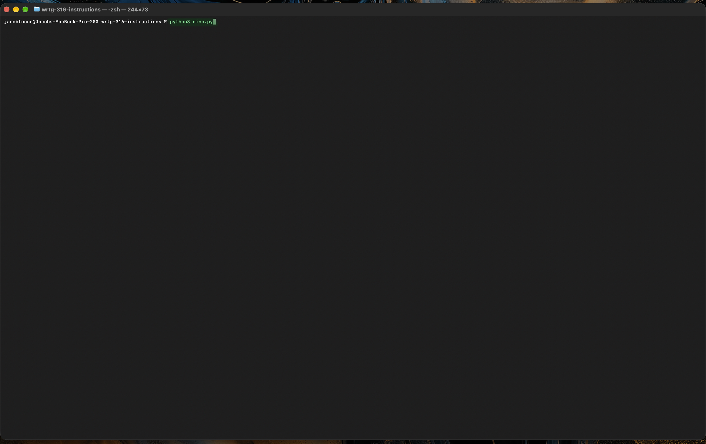
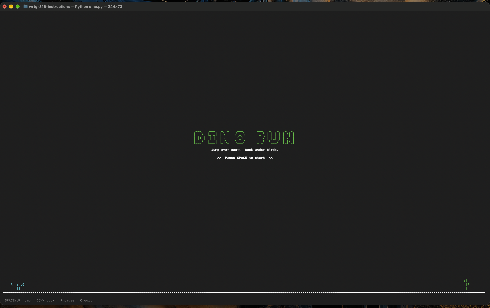
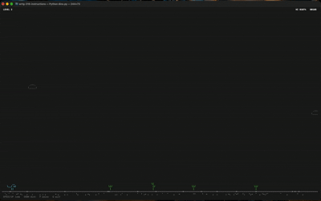

## Numbered Steps

### Step 1: Open the Terminal

1. Press **Command + Space** to open Spotlight Search.

   

2. Type `Terminal` and press **Return**.

   

A window opens with a line of text that ends in `%`. This window is the terminal.

### Step 2: Confirm That Git and Python Are Installed

1. Type the following command and press **Return**:

   ```
   git --version
   ```

   

2. Type the following command and press **Return**:

   ```
   python3 --version
   ```

   

Each command should display a version number, such as `git version 2.39.5` or `Python 3.9.6`. Your username, computer name, and version numbers may differ from these examples.

> **Troubleshooting**
>
> **`python3: command not found` appears.** Download and install Python from https://www.python.org/downloads/macos/. Close and reopen Terminal, then run `python3 --version` again.
>
> **`git: command not found` appears.** Install Git with Homebrew:
>
> 1. If Homebrew is not installed, follow the installation instructions at https://brew.sh/. Follow the installer's **Next steps** to make the `brew` command available in Terminal.
> 2. Type `brew install git` and press **Return**. Wait for the installation to finish.
> 3. Close and reopen Terminal, then run `git --version` again to confirm that Git is installed.
>
> If `brew: command not found` appears, complete the Homebrew installer's **Next steps**, then try again.

### Step 3: Move to Your Home Folder

Type the following command and press **Return**:

```
cd ~
```



### Step 4: Download (Clone) the Program

Type the following command and press **Return**:

```
git clone https://github.com/trevorwattles/wrtg-316-instructions.git
```


Wait until the line `Receiving objects: 100%` appears and the cursor returns.

> **Troubleshooting**
>
> **`destination path ... already exists` appears.** The program is already downloaded. Continue to Step 5.

### Step 5: Open the Program's Folder

Type the following command and press **Return**:

```
cd wrtg-316-instructions
```


### Step 6: Confirm That the Game File Is Present

Type the following command and press **Return**:

```
ls
```



The file `dino.py` should appear in the list.

### Step 7: Enlarge the Terminal Window

Double-click the title bar at the top of the Terminal window to enlarge it. The game needs space to display correctly.



### Step 8: Run the Game

Type the following command and press **Return**:

```
python3 dino.py
```



The dinosaur game appears in the Terminal window.



> **Troubleshooting**
>
> **`No such file or directory` appears.** You are in the wrong folder. Repeat Step 5.
>
> **The game looks cut off or garbled.** Enlarge the window (Step 7) and run the game again.

### Step 9: Play the Game

Press **Space** to start. Use the following keys to play:

| Key                               | Action |
| --------------------------------- | ------ |
| **Space**, **W**, or **Up Arrow** | Jump   |
| **S** or **Down Arrow**           | Duck   |
| **P**                             | Pause  |

Press **Q** to quit when you are done playing. The normal Terminal window returns.



> **Troubleshooting**
>
> **The keys do nothing.** Click inside the Terminal window, then try again.

---

## General Troubleshooting

These problems can happen during any step.

| Problem                       | Solution                                           |
| ----------------------------- | -------------------------------------------------- |
| The Terminal stops responding | Press **Control + C** to stop the current command. |
