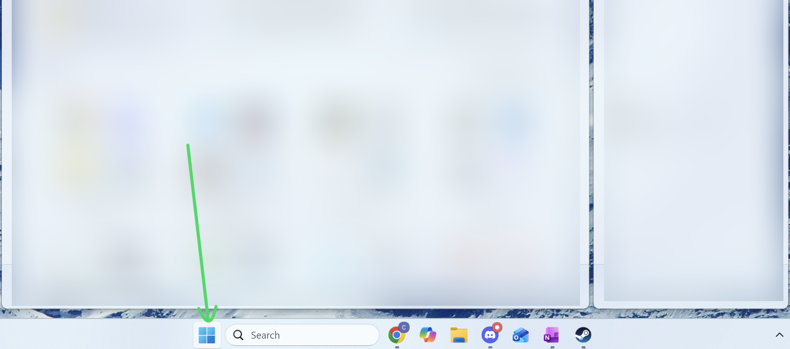
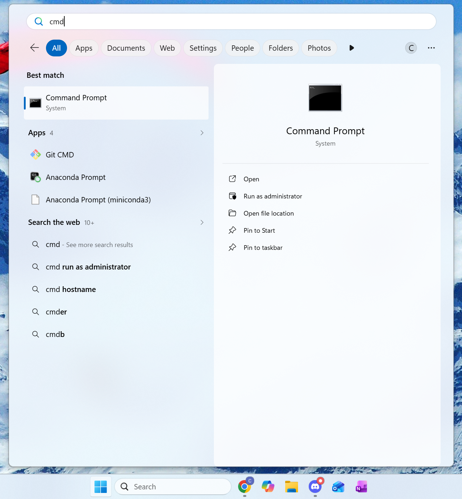
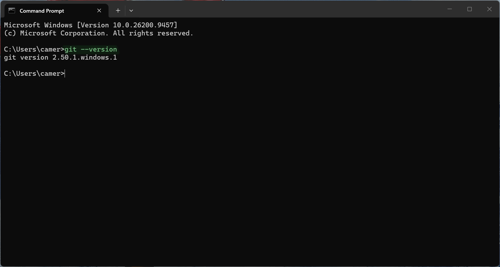
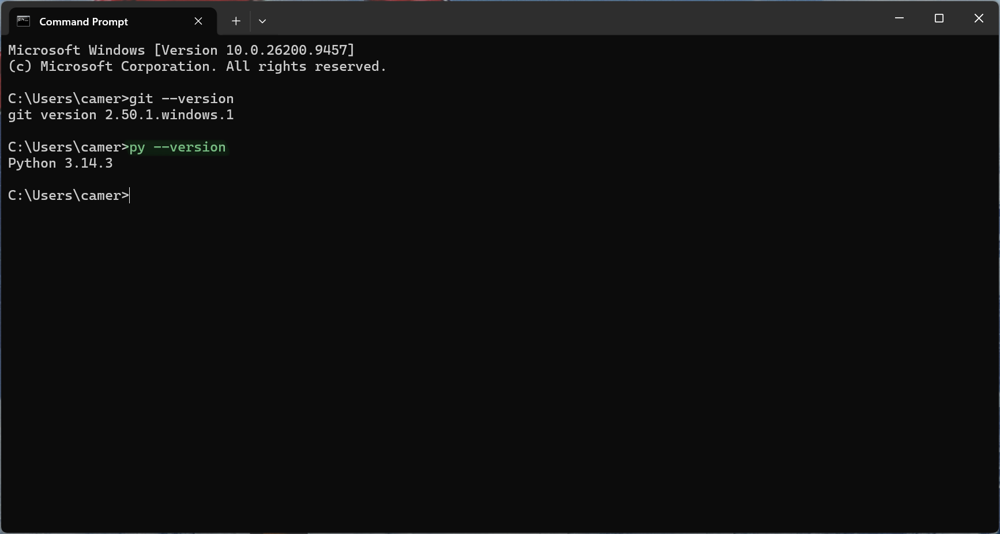
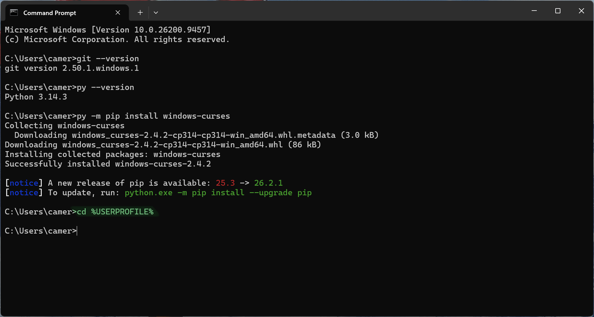
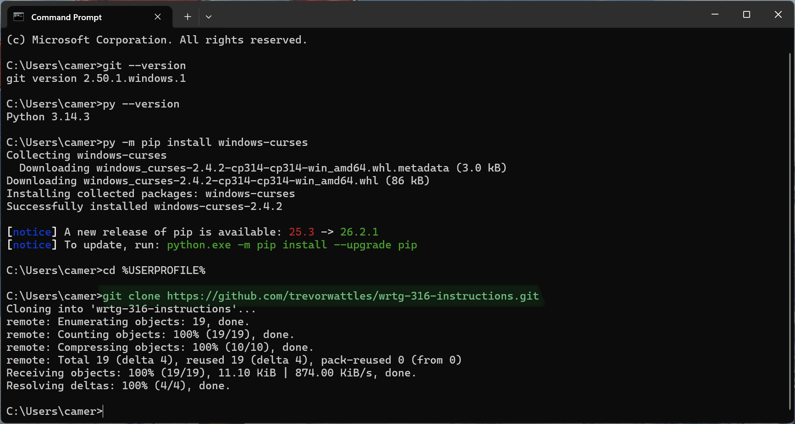
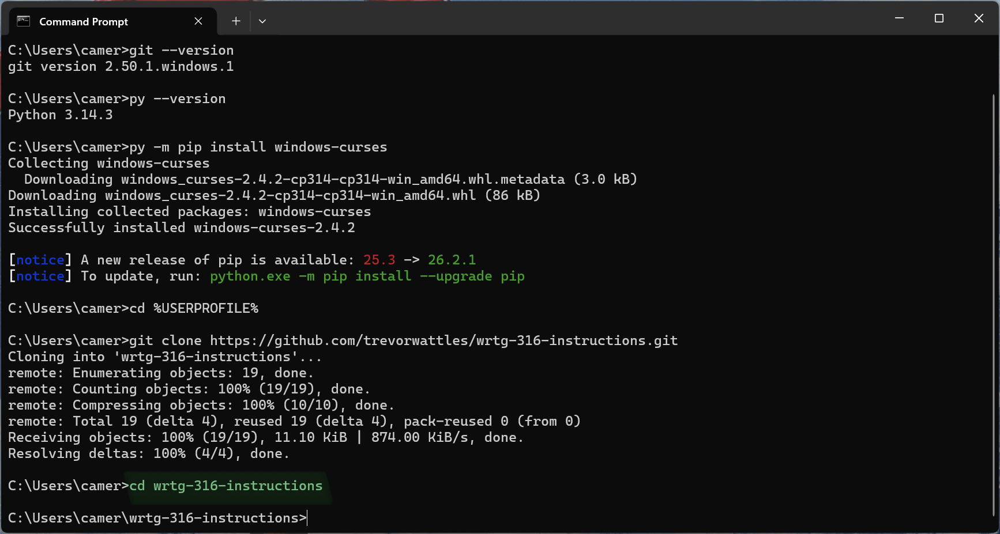
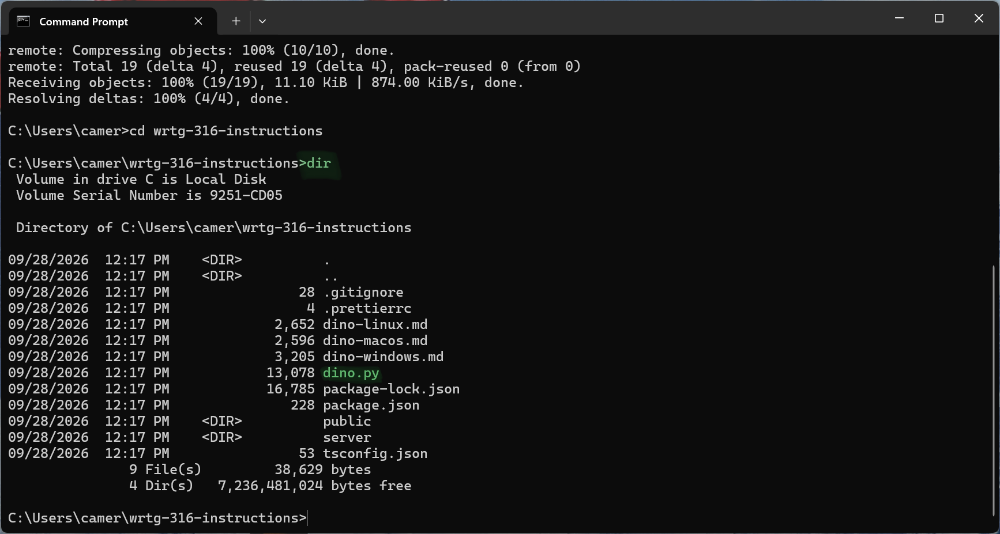
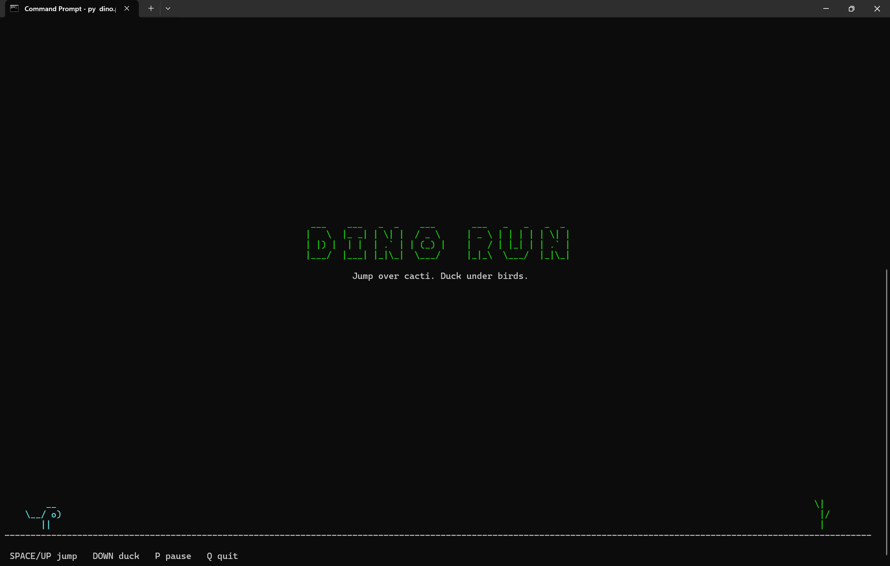
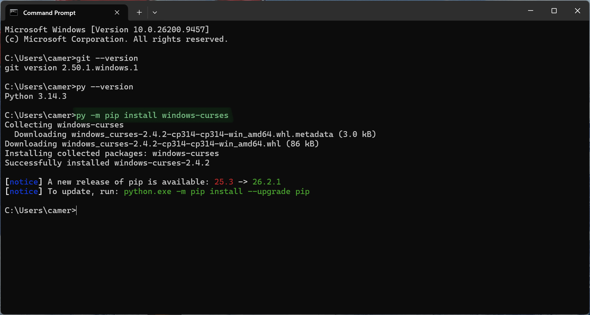

## Numbered Steps

### Step 1: Open the Command Prompt

1. Click the **Start** button.

   

2. Type `cmd`.
3. Click **Command Prompt**.

   

A black window opens with a line such as `C:\Users\YourName>`. This window is the Command Prompt.

### Step 2: Confirm That Git and Python Are Installed

1. Type the following command and press **Enter**:

   ```
   git --version
   ```

   

2. Type the following command and press **Enter**:

   ```
   py --version
   ```

   

Each command should display a version number, such as `git version 2.47.0.windows.1` or `Python 3.13.0`. Your username, computer name, and version numbers may differ from these examples.

> **Troubleshooting**
>
> **`is not recognized as an internal or external command` appears.** Close and reopen the Command Prompt, then try again. If the error remains, install Git from **git-scm.com** and Python from **python.org**. In the Python installer, check the box labeled **Add python.exe to PATH**.
>
> **Typing `python` opens the Microsoft Store.** Type `py` instead of `python`, as shown in these instructions.

### Step 3: Move to Your User Folder

Type the following command and press **Enter**:

```
cd %USERPROFILE%
```



### Step 4: Download (Clone) the Program

Type the following command and press **Enter**:

```
git clone https://github.com/trevorwattles/wrtg-316-instructions.git
```



Wait until the line `Receiving objects: 100%` appears and the cursor returns.

> **Troubleshooting**
>
> **`destination path ... already exists` appears.** The program is already downloaded. Continue to Step 5.

### Step 5: Open the Program's Folder

Type the following command and press **Enter**:

```
cd wrtg-316-instructions
```



### Step 6: Confirm That the Game File Is Present

Type the following command and press **Enter**:

```
dir
```



The file `dino.py` should appear in the list.

### Step 7: Maximize the Window

Click the **Maximize** button (the square in the upper-right corner of the window). The game needs space to display correctly.

### Step 8: Run the Game

Type the following command and press **Enter**:

```
py dino.py
```

The dinosaur game appears in the Command Prompt window.



> **Troubleshooting**
>
> **`No module named '_curses'` appears.** Windows needs one small add-on for the game to display in the Command Prompt. Type the following command and press **Enter**:
>
> ```
> py -m pip install windows-curses
> ```
>
> 
>
> Wait until the line `Successfully installed windows-curses` appears. Then run `py dino.py` again.
>
> **`No such file or directory` appears.** You are in the wrong folder. Repeat Step 5.
>
> **The game looks cut off or garbled.** Maximize the window (Step 7) and run the game again.

### Step 9: Play the Game

Press **Space** to start. Use the following keys to play:

| Key                               | Action |
| --------------------------------- | ------ |
| **Space**, **W**, or **Up Arrow** | Jump   |
| **S** or **Down Arrow**           | Duck   |
| **P**                             | Pause  |

Press **Q** to quit when you are done playing. The normal Command Prompt window returns.

> **Troubleshooting**
>
> **The keys do nothing.** Click inside the Command Prompt window, then try again.

---

## General Troubleshooting

These problems can happen during any step.

| Problem                             | Solution                                        |
| ----------------------------------- | ----------------------------------------------- |
| The Command Prompt stops responding | Press **Ctrl + C** to stop the current command. |
